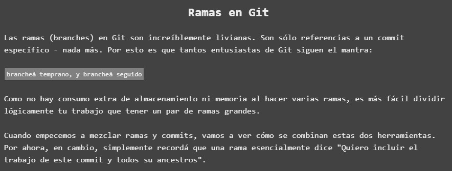
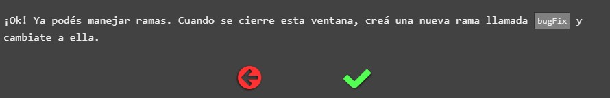
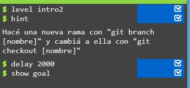
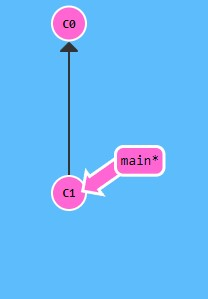
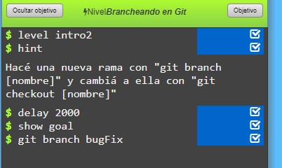
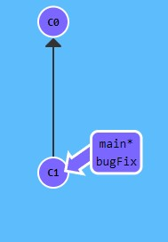
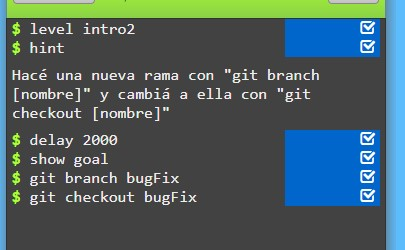
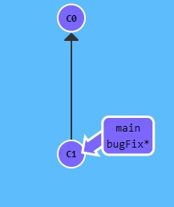

Como se nos indica en el enunciado, en este segundo ejercicio introductorio trabajaremos con las ramas en Git. Como podemos ver, éste nos ofrece una pequeña introduccion conceptual a lo que es una "rama en Git"

# Comenzando Ejercicio

En este ejercicio deberemos realizar la siguiente tarea asiganada:

Una vez situado en el editor, se nos muestra por consola el siguiente código:

**Encontrándonos en esta parte del diagrama**

LLegados a este punto, deberemos crear una nueva rama para la rama principal master, para ello, y tal como nos indica el codigo, escribo en linea de comandos la instucción **git branch [nombre]**

Vemos como la interfaz ha creado nuestra rama bugFix

Continuamos el ejercicio haciendo cambiandonos a la rama creada mediante **git checkout primeraRa**

Y con este ultimo comando logramos completar el ejercicio al cambiarnos exitosamente a la rama creada **"bugFix"**

