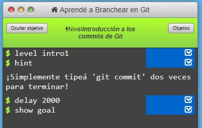
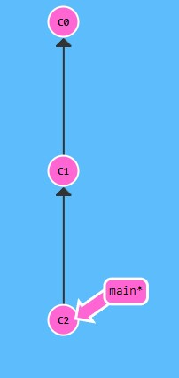
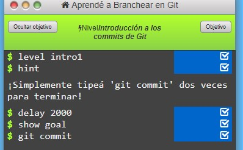

# Ejercicio 1 Learn Git Branching

## _Descripcion del Problema_

En este problema introductorio, se nos solicita realizar dos entregas o commit del proyecto una vez hayamos hecho los cambios en el mismos correspondientes

Nada mas iniciar el ejercicio, se nos presentan los siguientes comandos iniciales:

Siguiendo las indicaciones que se nos muestran, deberemos escribir el comando correspondiente en la parte inferior del cuadro

Una vez introducido, vemos que se ha realizado el primer commit del proyecto:

Con el correspondiente comando integrado en consola:

Finalmente, tras introducir una segunda linea de comandos "git commit" resolveremos este primer ejercio introductorio.

Vemos que la rama principal y la linea de comandos quedan de la siguiente forma mostrada.

